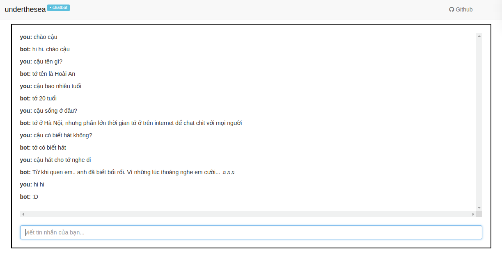

# Chatbot tiếng Việt


Dự án nghiên cứu về bài toán xây dựng *chatbot tiếng Việt*, được phát triển bởi nhóm nghiên cứu xử lý ngôn ngữ tự nhiên tiếng Việt - [underthesea](https://github.com/undertheseanlp). Chứa mã nguồn các thử nghiệm cho việc xây dựng một chatbot đơn giản, tích hợp với django và có thể triển khai dưới dạng một ứng dụng Web.

**Nhóm tác giả**

* Vũ Anh ([anhv.ict91@gmail.com](anhv.ict91@gmail.com))
* Nguyễn Thị Hậu ([nguyenhau1996mta@gmail.com](nguyenhau1996mta@gmail.com))
* Trương Thị Huyên ([huyenth2110@gmail.com](huyenth2110@gmail.com))
* Cao Thanh Tùng ([caothanhtungst@gmail.com](caothanhtungst@gmail.com))
* Hồ Thanh Luân ([hothanhluan1996@gmail.com](hothanhluan1996@gmail.com))

**Tham gia đóng góp**

 Mọi ý kiến đóng góp hoặc yêu cầu trợ giúp xin gửi vào mục [Issues](../../issues) của dự án. Các thảo luận được khuyến khích **sử dụng tiếng Việt** để dễ dàng trong quá trình trao đổi. 
 
Nếu bạn có kinh nghiệm trong bài toán này, muốn tham gia vào nhóm phát triển với vai trò là [Developer](https://github.com/undertheseanlp/underthesea/wiki/H%C6%B0%E1%BB%9Bng-d%E1%BA%ABn-%C4%91%C3%B3ng-g%C3%B3p#developercontributor), xin hãy đọc kỹ [Hướng dẫn tham gia đóng góp](https://github.com/undertheseanlp/underthesea/wiki/H%C6%B0%E1%BB%9Bng-d%E1%BA%ABn-%C4%91%C3%B3ng-g%C3%B3p#developercontributor).

## Mục lục

* [Giới thiệu về Hoài An](#giới-thiệu-về-hoài-an)
* [Yêu cầu hệ thống](#yêu-cầu-hệ-thống)
* [Thiết lập môi trường](#thiết-lập-môi-trường)
* [Hướng dẫn sử dụng](#hướng-dẫn-sử-dụng)
* [Bản quyền](#bản-quyền)

## Giới thiệu về Hoài An 

Sản phẩm đầu tiên của dự án là chatbot Hoài An. Với mục tiêu là một chat-chit bot (bot để trò chuyện tán ngẫu), Hoài An được xây dựng như là một cô gái 20 tuổi, sống ở Hà Nội, thích trò chuyện với mọi người.



## Yêu cầu hệ thống

* `Operating Systems: Linux (Ubuntu, CentOS), Mac`
* `Python 3.6+`, `Anaconda 4+`
* `Django==1.11.1`

## Thiết lập môi trường

Tải project bằng cách sử dụng lệnh `git clone`

```
$ git clone https://github.com/undertheseanlp/chatbot.git
```

Tạo môi trường mới và cài đặt các gói liên quan

```
cd chatbot
conda create -n chatbot python=3.6
source activate chatbot
pip install -r requirements.txt
```

## Hướng dẫn sử dụng

### Chạy chương trình chatbot trên trình duyệt 
 
Kích hoạt môi trường 

```
$ cd chatbot
$ source chatbot-env.sh
```

Lệnh `chatbot` đã sẵn sàng

```
$ chabot  

  Console script for chatbot

Options:
  --help  Show this message and exit.

Commands:
  log     Log handling
  server  Server handling
```


**Bước 1: Bật chatscript server**

```
chatbot server cs
```

**Bước 2: Build chatbot**

``` 
chatbot build
```

**Bước 3: Bật web server**

```
chatbot server web 
```

**Hoàn thành!!!**

Sau đó, mở trình duyệt, vào đường dẫn [http://127.0.0.1:8001](http://127.0.0.1:8001) để bắt đầu chat với bot 

### Thử nghiệm chatbot trên terminal

Kích hoạt môi trường 

```
$ cd chatbot
$ source chatbot-env.sh
```

Chạy chatbot trên terminal

```
$ chatbot server cs-local 
```

## Bản quyền

Mã nguồn của dự án được phân phối theo giấy phép [GPL-3.0](LICENSE.txt).
